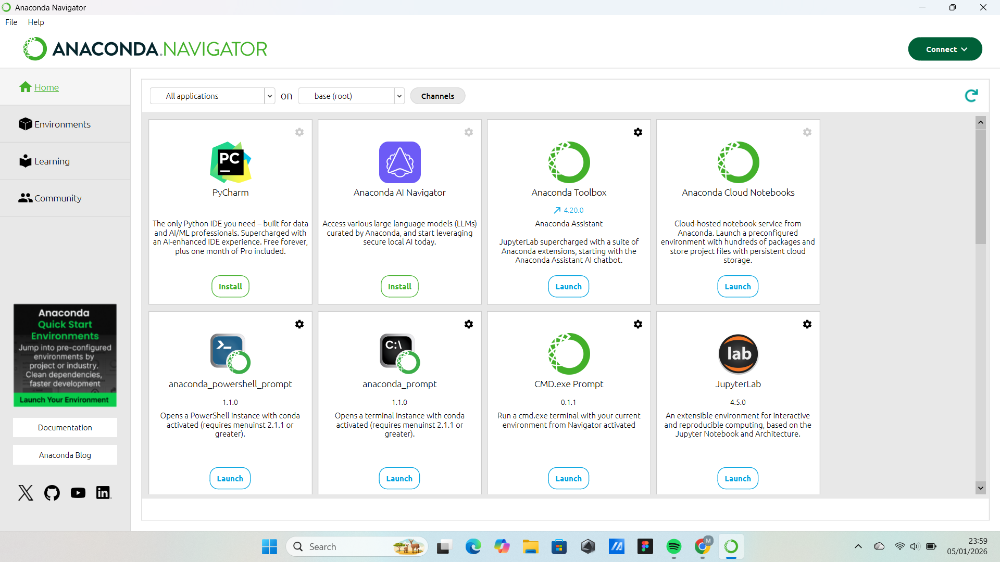

# Instalasi Tools Data Analyst

Repository ini dibuat untuk memenuhi tugas bootcamp Data Analyst terkait penggunaan GitHub dan dokumentasi instalasi tools.

## Tujuan
Mendokumentasikan proses instalasi dan konfigurasi tools yang dibutuhkan untuk Data Analyst.

## Tools yang Digunakan
- Vscode
- Anaconda

- Google colab
- Github
- PostgreSQL
- DBeaver
- Tableau
- PowerBI
- Docker
- Pyspark
- Google Cloud
- FastAPI
- Node.js
- Postman
- MySQL
- mongoDB
- ExpressJS

## Cara Instalasi

### 1. Python & Anaconda
Install Python melalui Anaconda untuk memudahkan pengelolaan environment dan library data analysis.

### 2. Database
- Install MySQL atau PostgreSQL sesuai kebutuhan
- Gunakan DBeaver sebagai database client

### 3. Backend & API
- Install Node.js
- Install ExpressJS menggunakan npm
- Install FastAPI menggunakan pip

### 4. Tools Pendukung
- Install VS Code sebagai code editor
- Install Postman untuk testing API
- Gunakan Google Colab untuk analisis berbasis cloud

## Cara Penggunaan
Repository ini digunakan sebagai dokumentasi dan referensi instalasi tools Data Analyst.
